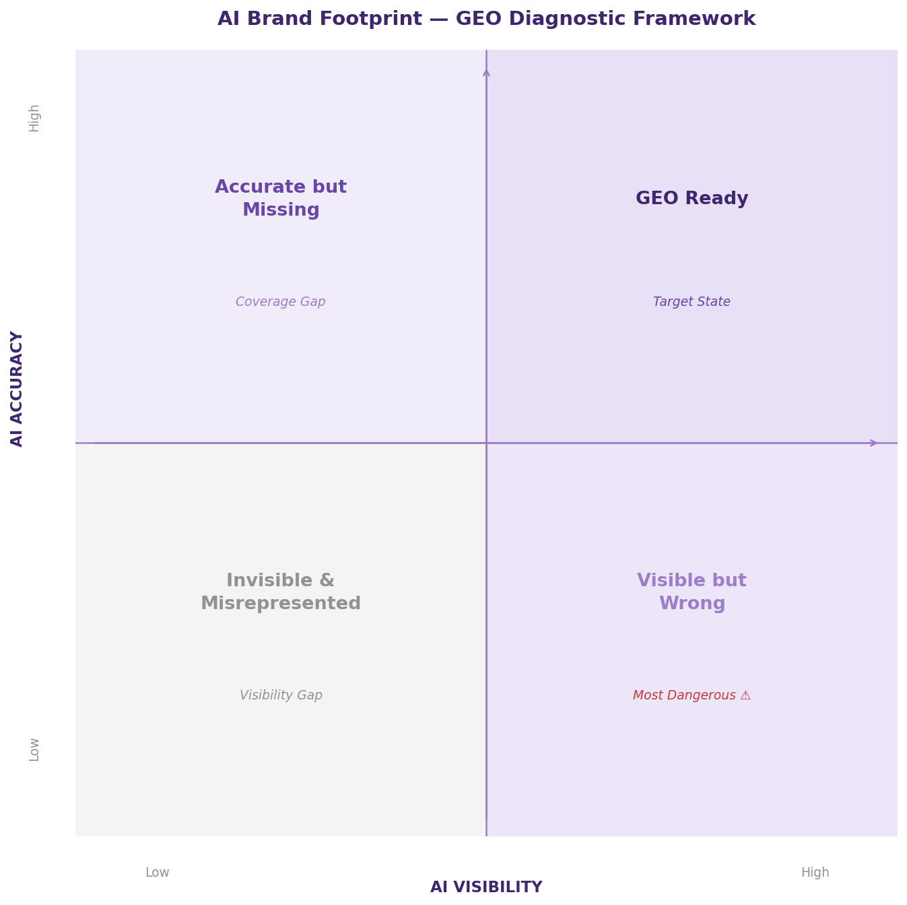

# AI Brand Footprint Audit

A brand AI visibility diagnostic tool built on the GEO (Generative Engine Optimization) framework. Enter a brand name, automatically query Claude and Grok, analyze how the brand is recommended, described, and positioned across AI models — then download a full PDF diagnostic report.

---

## Research Background

This tool originated from an independent research project at NYU Stern School of Business (Digital Strategy, Spring 2026), focused on **Generative Engine Optimization (GEO)** — how brands get discovered, recommended, and accurately described inside AI model responses.

As consumers increasingly turn to ChatGPT, Claude, Perplexity, and similar tools for product recommendations, the logic of traditional SEO is being restructured. The core question this tool answers:

> **"Who told AI that about your brand — and is it actually true?"**

---

## Core Features

- **Dual-model parallel query** — simultaneously queries Claude (Anthropic) and Grok (xAI), enabling side-by-side comparison
- **Three-dimension scoring**
  - **Citation Rank** — where the brand appears in AI's unprompted recommendation list
  - **Accuracy** — whether AI's description of the brand is specific and correct
  - **Head-to-Head** *(optional)* — direct comparison against a named competitor
- **GEO Score 0–100** — weighted composite of all three dimensions
- **Four-quadrant diagnosis** — positions the brand and gives targeted action advice
- **PDF report export** — full report with scores, diagnosis, and raw AI responses

---

## Four-Quadrant Diagnostic Framework



| Diagnosis | Meaning | Recommended Action |
|---|---|---|
| **GEO Ready** | AI surfaces your brand accurately and consistently | Monitor regularly to maintain position |
| **Accurate but Missing** | AI describes you correctly but rarely recommends you | Build third-party content coverage |
| **Visible but Wrong** | AI recommends you but describes you incorrectly | Most dangerous state — trace and correct AI signal sources immediately |
| **Invisible & Misrepresented** | AI doesn't know or recommend your brand | Build full GEO content foundation from scratch |

---

## Scoring Methodology

GEO Score is computed by Claude-as-Judge — not keyword counting.

| Dimension | How It's Scored | Weight (no competitor) | Weight (with competitor) |
|---|---|---|---|
| Citation Rank | Judge identifies brand's position in recommendation list (1st = 10pts, not mentioned = 0) | 50% | 40% |
| Accuracy | Judge rates specificity and correctness of AI's brand description (0–10) | 50% | 40% |
| Head-to-Head | Judge determines who wins the direct comparison (0–10) | — | 20% |

When no competitor is provided, Citation Rank acts as the implicit competitive signal — it measures how the brand ranks against the entire competitive landscape AI surfaces.

---

## Quick Start

### 1. Install dependencies

```bash
pip install -r requirements.txt
```

### 2. Configure API keys

Add your keys to `~/.streamlit/secrets.toml`:

```toml
ANTHROPIC_API_KEY = "sk-ant-..."
XAI_API_KEY = "xai-..."
```

Or enter them manually in the app sidebar (session only, never stored).

### 3. Run the app

```bash
streamlit run app.py
```

### 4. Input fields

| Field | Description | Example |
|---|---|---|
| Brand Name | The brand you want to audit | `CeraVe` |
| Market Context | The market or use-case context | `sensitive skin` |
| Product Type | The specific product category | `moisturizer` |
| Competitor *(optional)* | A competitor brand for head-to-head comparison | `La Roche-Posay` |

Click **Run Audit** and wait ~30 seconds for results and PDF report.

---

## Tech Stack

| Component | Technology |
|---|---|
| Web UI | Streamlit |
| AI Model A | Claude Sonnet (Anthropic API) |
| AI Model B | Grok 3 Mini (xAI API) |
| Scoring Judge | Claude-as-Judge pattern |
| PDF Generation | fpdf2 |

---

## About GEO

GEO (Generative Engine Optimization) is the next evolution of SEO. When users ask AI "which brand is better," traditional search rankings lose relevance — what matters now is whether a brand has been trained into AI's knowledge, and whether it is described accurately.

This project mapped 7 GEO-native startups (Profound, Peec AI, Rankscale, Omnius, and others) against 3 incumbents (Semrush, Moz, WebFX), applied the Innovator's Dilemma to explain structural inertia, and conducted a primary founder interview with the CEO of a GEO startup serving CPG and enterprise brands. The diagnostic framework in this tool is built directly from that research.

---

## Author

**Puyue (Iris) Niu**  
NYU Tandon School of Engineering 
[LinkedIn](https://www.linkedin.com/in/puyue-niu/) · [Tableau Portfolio](https://public.tableau.com/app/profile/niu.niu6737/vizzes)
